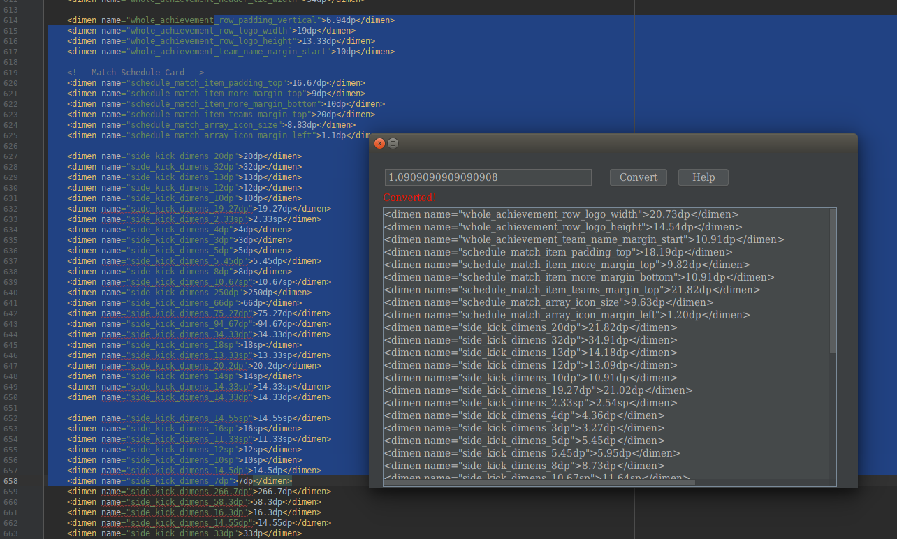

# DimensPlugin

### Android Studio插件，用于快速转换  dimens  数据 

插件下载地址：[下载](./out/DimensPlugin.jar)     
Notes：目前更新到v1.1版本   

 

#### 如何使用？
- **Step1:** 下载插件
- **Step2:** 从本地安装安装插件到Android Studio
- **Step3:** 选中要转换的dimens数据
- **Step4:** 打开 DimensPlugin 插件，即可展示转换后数据

 

#### 如何打开？
- **快捷键**：**ctrl + shift + alt + D**
- **tools**工具栏下找到 **DimensPlugin** 打开

 

#### V1.0 预览视图
